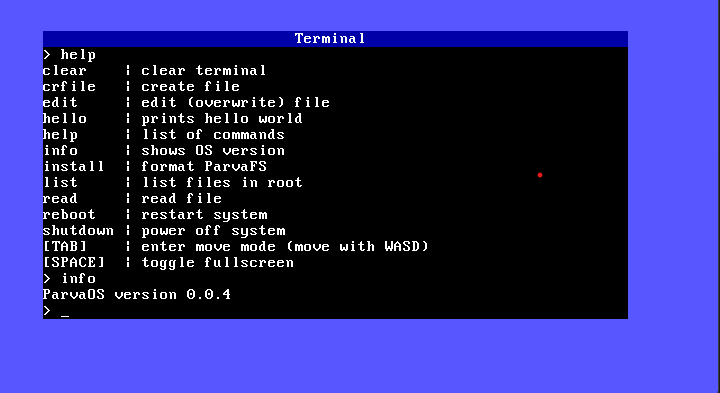

# ParvaOS *(v. 0.0.3)*

 

**ParvaOS** is an operating system written from scratch in Rust by Francesco Giannice. It is capable of running on all 64-bit x86 architecture computers with BIOS and has been found to run on QEMU as a virtual machine emulator.

## Features

- x86 CPU support (64 bit)
- VGA Text Mode
- Serial output
- CPU exceptions management
- Paging
- Heap allocation
- Basic shell
- Time management (PIT-based system)
- Driver ATA PIO Mode (Programmed Input/Output)
- Custom File System ([ParvaFS](doc/ParvaFS.md))
- Graphical User Interface (GUI)

## Documentation

Documentation is available in [doc](doc/Commands.md)/ folder

## How to run ParvaOS?

To use ParvaOS you can just download the `ParvaOS.img` file from the release section in GitHub, and then use it on real hardware or just on a virtual machine (I've tested that on QEMU everything works).

If you don't want to just download the image file and you'd like to compile everything from scratch, see the section below...

## How to compile ParvaOS' code?

As I said you can just download the release image file of the operating system. But if otherwise you want to compile the whole project on your local machine, follow these instructions:

1. **Install Rust:**

   Rust is required to compile ParvaOS. You can download it from [rust-lang.org](https://www.rust-lang.org/).

2. **Clone the repo:**

    ```
    git clone https://github.com/gianndev/ParvaOS.git
    cd ParvaOS
    ```

3. **Compile the Rust code:**
    
    To build the image of the operating system you can use the `bootimage` crate and then use the Makefile, just typing
    ```
    cargo install bootimage
    make image
    ```

4. **Run ParvaOS:**
    
    Once the image file is created, you can run it with QEMU typing in the terminal

    ```
    make run
    ```
    
    Make sure to have QEMU installed

## Version

The current latest version of ParvaOS is **0.0.3**

## License

This project is licensed under the terms of the GNU General Public License v3.0 only (GPL-3.0-only).  
See the [LICENSE](./LICENSE) file for details.